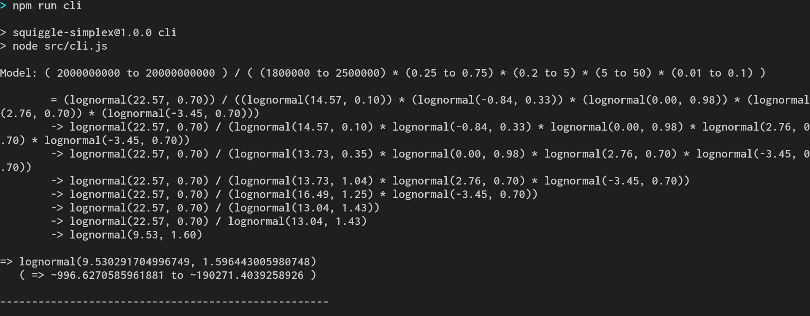

# Simple Squiggle

## About


"Simple Squiggle" is a simple parser that manipulates multiplications and divisions between numbers and lognormal distributions. It uses an extremely restricted subset of [Squiggle](https://github.com/quantified-uncertainty/squiggle)'s syntax, and unlike it, the underlying code is not easily extensible.

It may be useful for testing correctness of limited features of the full Squiggle, or for sanity-checking the validity of some Squiggle models.



## Built with

- [Node.js](https://nodejs.org/en/)
- [Math.js](https://mathjs.org/)
- [Best Readme template](https://github.com/othneildrew/Best-README-Template/blob/master/README.md)

## Getting started

### Prerequisites

- npm
- nodejs

### Installation

```
git clone https://github.com/quantified-uncertainty/simple-squiggle.git
cd simple-squiggle
## npm install
```

The last line is not necessary, since I'm saving node_packages in the repository.

## Usage

Consider a squiggle model which only uses lognormals:

```
initialPrisonPopulation = 1.8M to 2.5M # Data for 2022 prison population has not yet been published, though this estimate is perhaps too wide.
reductionInPrisonPopulation = 0.25 to 0.75
badnessOfPrisonInQALYs = 0.2 to 5 # 80% as good as being alive to 5 times worse than living is good
accelerationInYears = 5 to 50
probabilityOfSuccess = 0.01 to 0.1 # 1% to 10%.
estimateQALYs = leftTruncate(
    initialPrisonPopulation *
    reductionInPrisonPopulation *
    badnessOfPrisonInQALYs *
    accelerationInYears *
    probabilityOfSuccess
    , 0)
cost = 2B to 20B
costEffectivenessPerQALY = leftTruncate(cost / estimateQALYs, 0)
costEffectivenessPerQALY
```

It can be simplified to the following simple squiggle model:

```
( 2000000000 to 20000000000 ) / ( (1800000 to 2500000) * (0.25 to 0.75) * (0.2 to 5) * (5 to 50) * (0.01 to 0.1) )
```

I provide both an exportable library and a command line interface (cli). The cli can be run with `npm run cli`, which produces a prompt:

```
> npm run cli

Model:
```

After filling in the prompt

```
> npm run cli

Model: ( 2000000000 to 20000000000 ) / ( (1800000 to 2500000) * (0.25 to 0.75) * (0.2 to 5) * (5 to 50) * (0.01 to 0.1) )
```

the output looks as follows:

```
> npm run cli

Model: ( 2000000000 to 20000000000 ) / ( (1800000 to 2500000) * (0.25 to 0.75) * (0.2 to 5) * (5 to 50) * (0.01 to 0.1) )

        = (lognormal(22.57, 0.70)) / ((lognormal(14.57, 0.10)) * (lognormal(-0.84, 0.33)) * (lognormal(0.00, 0.98)) * (lognormal(2.76, 0.70)) * (lognormal(-3.45, 0.70)))
        -> lognormal(22.57, 0.70) / (lognormal(14.57, 0.10) * lognormal(-0.84, 0.33) * lognormal(0.00, 0.98) * lognormal(2.76, 0.70) * lognormal(-3.45, 0.70))
        -> lognormal(22.57, 0.70) / (lognormal(13.73, 0.35) * lognormal(0.00, 0.98) * lognormal(2.76, 0.70) * lognormal(-3.45, 0.70))
        -> lognormal(22.57, 0.70) / (lognormal(13.73, 1.04) * lognormal(2.76, 0.70) * lognormal(-3.45, 0.70))
        -> lognormal(22.57, 0.70) / (lognormal(16.49, 1.25) * lognormal(-3.45, 0.70))
        -> lognormal(22.57, 0.70) / (lognormal(13.04, 1.43))
        -> lognormal(22.57, 0.70) / lognormal(13.04, 1.43)
        -> lognormal(9.53, 1.60)

=> lognormal(9.530291704996749, 1.596443005980748)
   ( => ~996.6270585961881 to ~190271.4039258926 )

----------------------------------------------------

```

For ease of representation, the intermediary outputs are printed only to two decimal points. But this is just a display decision; the innards of the program work with the full set of decimals.

You can also run tests with `npm run test`

## Roadmap

I consider this repository to be feature complete. As such, I may tinker with the code which wraps around the core logic, but I don't really intend to add further functionality.

- [ ] Make wrapper code less hacky
- [ ] Display final lognormal as a 90% confidence interval as well

## License

Distributed under the MIT License
